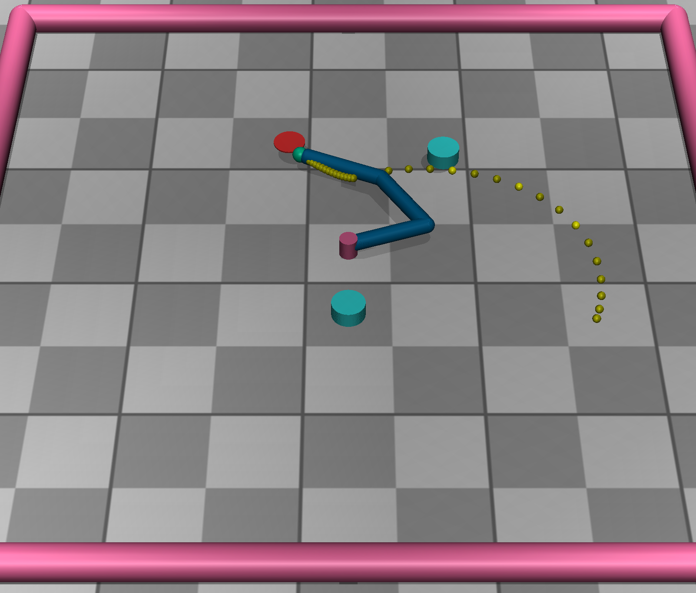
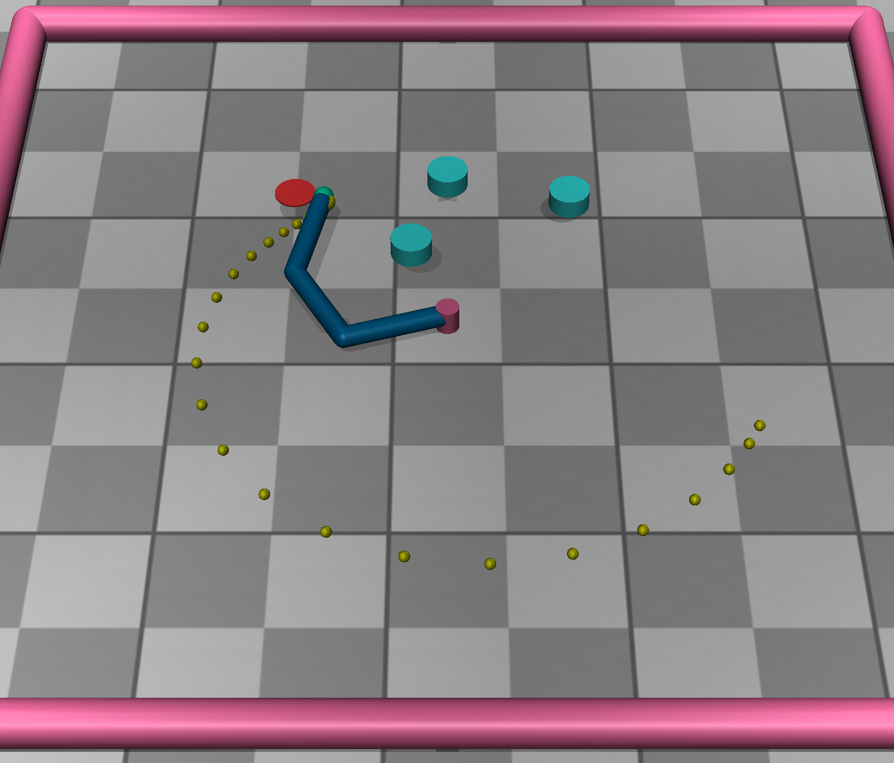

# Reacher with Obstacles
This repo contains some experiments for the paper "Exploiting Robot
Abstractions in Episodic RL via Reward Shaping and Heuristics". The context
is a planar 2D grid with a three-link planar manipulator (more information
[here](https://gymnasium.farama.org/environments/mujoco/reacher/)). The
goal of the task is to reach a point with the end-effector, avoiding
collisions with the obstacles in the environment. We trained the agent both
with the RL methods presented in the paper, and also using trajectory
optimization.

<div align="center">

</div>

<div align="center">

</div>


## Acknowledgements

This work is based on the paper "Exploiting Robot Abstractions in Episodic RL via Reward Shaping and Heuristics". Please cite the original paper if you use this code in your research.

## Citation 

If you use this code, please cite:

```bibtex
@article{cipollone2025exploiting,
  title={Exploiting Robot Abstractions in Episodic RL via Reward Shaping and Heuristics},
  author={Cipollone, Roberto and Favorito, Marco and Maiorana, Flavio and De Giacomo, Giuseppe and Iocchi, Luca and Patrizi, Fabio},
  journal={Elsevier},
  year={2025}
}
```

## Code Usage

Use the pixi environment to run the code. Install pixi on
https://pixi.sh/latest/. Then, install the environment by running `pixi
install`.

### RL Training

Run 
    
    pixi run rl-train [EXPERIMENT ID]
with experiment id referring to the key
of the `EXPERIMENTS` map

Example:

    pixi run rl-train 1a [--seed <SEED>]

Use tensorboard to monitor the training

Reward function is designed to return values >0 at each step when the goal is reached.
So when the return is stable above 0 a good policy has been found.

Note: models are automatically saved at the end of each training phase and automatically reloaded at each run of the experiment

#### Play the learned policy

Example:

    pixi run rl-eval 1a [--seed <SEED>]


Note: `info[reward_goal]` printed at the end of the policy execution is 1.0 if the goal has been reached.

#### Configure the environment

To add or modify environment configurations, use `CONFIGS` structure in `reacher_v6.py`

Environments ids are automatically registered using all the keys in `CONFIGS` 

    Reacher-v6_{conf}
    Reacher3-v6_{conf}
    MARRtinoArm_{conf}

These environments use a standard dense reward based on distance to the target.

To use reward heuristics, use the following environments 

    Reacher-v6_{conf}_{rhV|rsV}
    Reacher3-v6_{conf}_{rhV|rsV}
    MARRtinoArm_{conf}_{rhV|rsV}

where `rhV` is a heuristic reward based on discrete V (optimal V of abstract MDP),
while 'rsV' is a reward shaping function based on discrete V.


### Trajectory Optimization

To run, save and play the trajectory optimization, run

    pixi run trajopt-train

To just play the found trajectory

    pixi run trajopt-eval

## Dataset Generation and Management

This repository includes tools for generating, storing, and analyzing trajectory datasets from both trajectory optimization and RL methods.

### Dataset Structure

Trajectories are stored in HDF5 format with the following information:

**Temporal Data:**
- `qpos`: Joint positions over time (T+1, nq)
- `qvel`: Joint velocities over time (T+1, nq)
- `qacc`: Joint accelerations over time (T, nq)
- `torques`: Control torques (T, nq)
- `ee_pos`: End-effector positions (T+1, 3)
- `ee_vel`: End-effector velocities (T+1, 3)
- `timestamps`: Time stamps for each step (T+1,)
- `obstacle_distances`: Distance to each obstacle (T+1, n_obstacles)

**Metrics (stored as attributes):**
- **Success metrics:** `success`, `goal_reached_step`, `final_error`, `mean_error`, `settling_time`
- **Safety metrics:** `min_obstacle_distance`, `mean_obstacle_distance`, `collision`, `safety_margin_violations`
- **Performance metrics:** `execution_time`, `energy`, `smoothness`, `path_length`, `max_velocity`, `max_acceleration`, `control_effort`, `control_variation`
- **Metadata:** `experiment_config`, `method`, `seed`, `target_pos`, `obstacle_pos`, `initial_qpos`, `njoints`, `dt`

### Dataset Metrics

The following metrics are automatically computed for each trajectory:

**Success Metrics:**
- Distance tolerance: 0.05 m (configurable)
- Success requires reaching target AND no collisions
- Settling time computed when trajectory stays within tolerance

**Safety Metrics:**
- Safety margin: 0.06 m from obstacles (configurable)
- Violations counted when distance < safety margin
- Minimum and mean distances tracked

**Performance Metrics:**
- Energy: ∫ τ²dt (sum of squared torques)
- Smoothness: ∫ q̈²dt (sum of squared accelerations)
- Control effort: ∫ |τ|dt (L1 norm of torques)
- Control variation: ∫ (dτ/dt)²dt (temporal smoothness)

### Building a Dataset

Generate trajectories for all experiments using trajectory optimization:

```bash
pixi run build-dataset [--plot] [--name DATASET_NAME]
```

Options:
- `--plot`: Visualize trajectories during generation
- `--name`: Name for the output dataset file (default: `trajopt_dataset`)

This will:
1. Solve trajectory optimization for each experiment in `EXPERIMENTS`
2. Simulate the trajectories and compute all metrics
3. Save individual trajectories to `data/trajectories/`
4. Combine all trajectories into a single dataset file `data/DATASET_NAME.h5`
